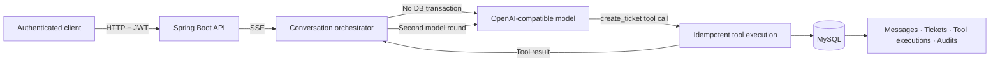

# NexusAgent

NexusAgent 是一个多租户企业智能工单 Agent 平台。用户通过自然语言描述问题，系统以 SSE 流式调用 OpenAI-compatible 模型；当模型决定调用 `create_ticket` 时，后端会校验参数、幂等执行工具、创建真实工单，并持久化完整的会话、工具执行和安全审计记录。

> 当前版本：V0.1。核心闭环、生产运行镜像和自动化测试均已完成。

## 核心链路



完整流程：

1. JWT 用户在自己的租户内创建会话并发送消息。
2. 后端预占 USER 与 ASSISTANT 消息序号后提交事务。
3. 模型网络调用在数据库事务之外执行，并通过 SSE 返回增量文本。
4. 模型发出 `create_ticket` 时，后端登记带幂等键的 ToolExecution。
5. 工具执行事务原子创建 Ticket、TOOL 消息、后续 ASSISTANT 占位和审计记录。
6. 后端执行第二轮模型调用并完成最终 ASSISTANT 消息。
7. 客户端收到 `started`、`delta`、`completed` 或安全的 `error` 事件。

## 主要能力

- 多租户 Tenant、User、Role 与 JWT 身份认证
- ADMIN 管理 Agent 配置及状态生命周期
- Conversation 创建、详情、游标分页消息历史
- SSE 流式 Agent 对话与客户端断连处理
- OpenAI-compatible 模型网关和安全错误映射
- `create_ticket` 工具调用、参数白名单和真实工单落库
- ToolExecution 双唯一键幂等、并发重放和状态机
- Ticket 创建、查询、游标分页及乐观锁状态流转
- 业务写入与 AuditLog 同事务提交、失败自动回滚
- Docker Compose 一键运行、健康探针和 graceful shutdown

## 技术栈

| 分类 | 技术 |
| --- | --- |
| 语言与运行时 | Java 21 |
| Web | Spring Boot 3.5、Spring MVC、SSE |
| 安全 | Spring Security、OAuth2 Resource Server、JWT、BCrypt |
| 数据访问 | MyBatis、MySQL 8.4、HikariCP |
| 数据库迁移 | Flyway |
| 模型接入 | OpenAI-compatible streaming API |
| 测试 | JUnit 5、Mockito、Testcontainers |
| 构建与交付 | Maven Wrapper、Docker、Docker Compose、GitHub Actions |

## 快速开始

### 环境要求

- Docker Desktop（支持 Docker Compose v2）
- PowerShell 7 或 Windows PowerShell 5.1（运行演示脚本时）

本地 Maven 开发还需要 JDK 21；纯 Docker 启动不需要本机安装 JDK 或 Maven。

### 1. 创建环境文件

```powershell
Copy-Item .env.example .env
```

生成解码后为 32 字节的 JWT Base64 密钥：

```powershell
$bytes = New-Object byte[] 32
[Security.Cryptography.RandomNumberGenerator]::Fill($bytes)
[Convert]::ToBase64String($bytes)
```

把输出写入 `.env` 的 `NEXUS_JWT_SECRET`。同时修改 MySQL 示例密码。

### 2. 选择模型运行模式

只体验身份、Agent、Conversation、Ticket 和查询 API 时可以保持：

```dotenv
NEXUS_OPENAI_ENABLED=false
OPENAI_API_KEY=
```

运行真实 SSE / `create_ticket` Agent 闭环时配置：

```dotenv
NEXUS_OPENAI_ENABLED=true
NEXUS_OPENAI_BASE_URL=https://api.openai.com/v1
OPENAI_API_KEY=your-api-key
```

密钥只通过环境变量注入，不会写入数据库、日志、审计或 Git。

### 3. 启动

```powershell
docker compose --env-file .env -f deploy/compose.yaml up -d --build --wait
```

检查服务：

```powershell
docker compose --env-file .env -f deploy/compose.yaml ps
Invoke-RestMethod http://localhost:8080/actuator/health/readiness
```

预期 readiness 状态为 `UP`，`app` 和 `mysql` 容器均为 `healthy`。

停止服务：

```powershell
docker compose --env-file .env -f deploy/compose.yaml down
```

如需同时删除本地 MySQL 数据卷，请明确执行 `down --volumes`；该操作会永久删除本地演示数据。

## 运行完整演示

配置真实模型后执行：

```powershell
powershell -ExecutionPolicy Bypass -File scripts/demo.ps1 `
  -ModelName "replace-with-enabled-model"
```

脚本会自动完成：启动服务、初始化唯一租户、登录、创建并激活 Agent、创建 Conversation、发起 SSE 工具调用、查询消息历史和生成的高优先级工单。脚本不会输出完整 JWT 或 API Key。

不调用外部模型的本地 smoke test：

```powershell
powershell -ExecutionPolicy Bypass -File scripts/demo.ps1 `
  -ModelName "local-smoke-model" `
  -SkipStream
```

也可以使用 IntelliJ HTTP Client 逐步执行 [API examples](docs/api-examples.http)。

## API 概览

| 方法 | 路径 | 权限 | 说明 |
| --- | --- | --- | --- |
| POST | `/api/v1/tenants/bootstrap` | Public | 初始化租户和首个管理员 |
| POST | `/api/v1/auth/login` | Public | 获取 JWT access token |
| POST | `/api/v1/agents` | ADMIN | 创建 DRAFT Agent |
| GET | `/api/v1/agents/{agentCode}` | ADMIN | 查询 Agent 配置 |
| PATCH | `/api/v1/agents/{agentCode}/status` | ADMIN | Agent 状态流转 |
| POST | `/api/v1/conversations` | Authenticated | 创建会话和初始 USER 消息 |
| GET | `/api/v1/conversations/{id}` | Owner | 查询会话详情 |
| GET | `/api/v1/conversations/{id}/messages` | Owner | 游标分页查询消息 |
| POST | `/api/v1/conversations/{id}/messages` | Owner | 追加 USER 消息 |
| POST | `/api/v1/conversations/{id}/turns:stream` | Owner | 执行流式 Agent turn |
| POST | `/api/v1/tickets` | Authenticated | 用户直接创建工单 |
| GET | `/api/v1/tickets` | Authenticated | 过滤及游标分页查询工单 |
| GET | `/api/v1/tickets/{ticketNo}` | Authenticated | 查询工单详情 |
| PATCH | `/api/v1/tickets/{ticketNo}/status` | Authenticated | 乐观锁状态流转 |
| GET | `/actuator/health/readiness` | Public | 容器就绪探针 |

除 bootstrap/login/health 外，请求需要：

```http
Authorization: Bearer <access-token>
```

## Maven 多模块结构

```text
backend/
├── nexus-common       # ID、当前身份等公共内核
├── nexus-audit        # 事务审计契约与 MyBatis 实现
├── nexus-identity     # Tenant、User、Role、登录与初始化
├── nexus-ticket       # Ticket 领域、查询、状态机
├── nexus-agent        # Agent、Conversation、模型网关、ToolExecution
└── nexus-bootstrap    # Spring Boot 装配、安全、迁移和集成测试
```

详细依赖、时序与事务边界见 [Architecture](docs/architecture.md)。

## 数据一致性与安全

- `tenantId` 和 `userId` 来自已验证 JWT，不接受请求体注入。
- 所有业务查询显式携带 `tenant_id`；跨租户与非 owner 资源统一按不存在处理。
- Agent/Ticket 状态修改使用 `expectedVersion` 乐观锁。
- Conversation 通过父行锁和 `next_message_sequence` 分配连续消息序号，不使用并发不安全的 `MAX + 1`。
- ToolExecution 通过服务端生成的幂等键及 `(tenant, conversation, toolCallId)` 双唯一约束防止重复副作用。
- 模型网络调用不持有数据库事务；prepare/complete/fail 各自独立提交。
- AuditLog 使用 `MANDATORY` 加入业务事务，审计失败会回滚业务写入。
- system prompt、消息正文、模型异常详情、API Key 和工具敏感参数不写入安全审计。

## 测试与 CI

完整验证：

```powershell
cd backend
.\mvnw.cmd --batch-mode --no-transfer-progress verify
```

当前 V0.1 基线包含 1363 次自动化测试执行，其中 86 次为基于 MySQL 8.4 Testcontainers 的集成测试。覆盖多租户隔离、JWT/RBAC、事务回滚、乐观锁、消息并发、工具幂等、SSE、模型失败和完整 `create_ticket` Agent 闭环。

GitHub Actions 会在 pull request 和 `main` push 时执行 Maven verify，并构建生产 Docker 镜像。

## 更多文档

- [Architecture](docs/architecture.md)：模块、事务、并发和工具调用设计
- [API examples](docs/api-examples.http)：可直接执行的 HTTP 请求
- [Requirements](docs/requirements.md)：V0.1 原始目标与验收标准
