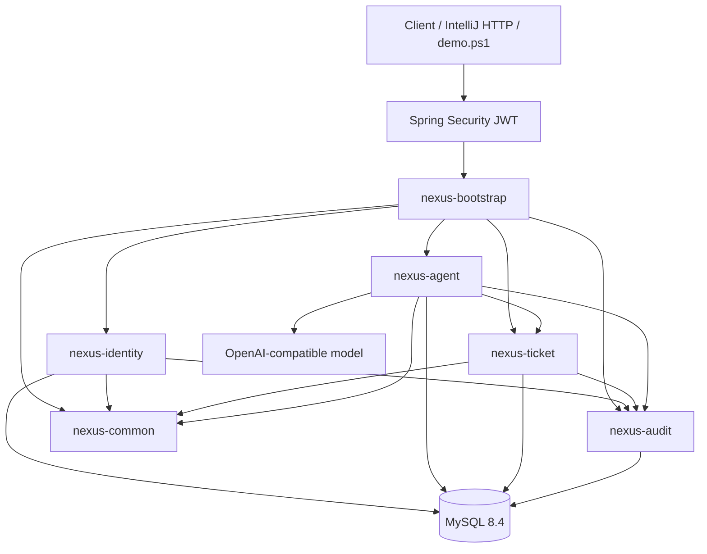
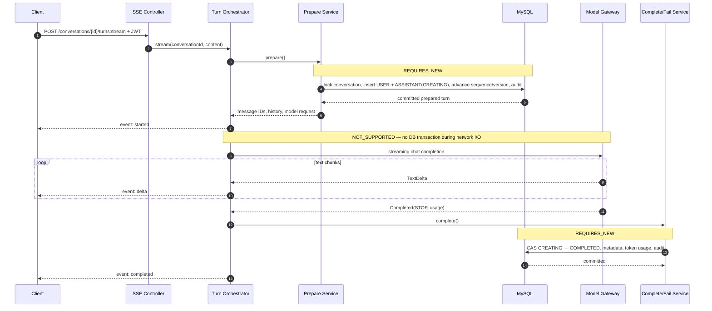
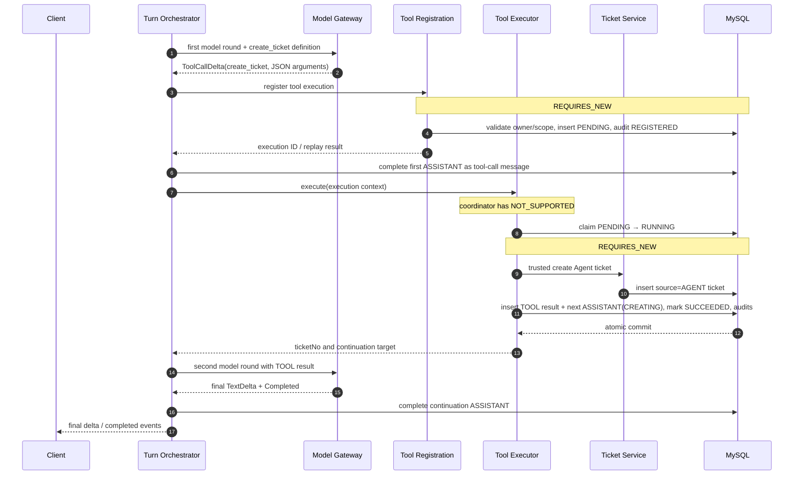

# NexusAgent Architecture

本文描述 NexusAgent V0.1 的模块边界、运行链路、租户隔离、事务传播、并发控制、幂等策略和失败补偿。它以当前生产代码为准，不包含尚未实现的规划能力。

## 1. 系统边界

NexusAgent 是单体部署、模块化设计的 Spring Boot 后端。业务模块在同一 JVM 和 MySQL 数据库内运行，避免在 V0.1 阶段过早引入分布式事务；模型调用是唯一外部网络依赖。



## 2. 模块职责

| 模块 | 主要职责 | 允许依赖 |
| --- | --- | --- |
| `nexus-common` | Snowflake ID、CurrentActor 等公共内核 | 无业务模块依赖 |
| `nexus-audit` | AuditLog 命令、持久化及事务约束 | common |
| `nexus-identity` | Tenant/User/Role、bootstrap、登录 | common、audit |
| `nexus-ticket` | Ticket 创建、查询、状态策略 | common、audit |
| `nexus-agent` | Agent、Conversation、模型流、工具编排 | common、audit、ticket |
| `nexus-bootstrap` | 应用入口、JWT、安全、配置、Flyway、IT | 全部模块 |

`nexus-agent → nexus-ticket` 是单向依赖。Agent 通过 ticket 模块发布的 trusted application contract 创建 `source=AGENT` 工单，不通过内部 HTTP，也不允许模型提供 tenant/user/agent 等可信身份字段。

## 3. 身份与多租户边界

JWT 包含 username、tenant 与 roles。`SpringSecurityCurrentActorProvider` 在认证线程中将其转换为 `CurrentActor`，业务服务仅从该对象获得 `tenantId/userId/roles`。

安全规则：

- 请求 DTO 不接受 tenantId、requesterUserId、createdByAgentId 等身份字段。
- Agent 管理 API 要求 `ROLE_ADMIN`，服务层仍保留 ADMIN 校验。
- Conversation 使用 `(tenant_id, user_id, conversation_id)` owner 条件。
- Ticket/Agent/ToolExecution 查询均显式包含 `tenant_id`。
- 外租户、非 owner、错误 Agent/message 关联统一收口为 404，不泄露资源存在性。
- 数据库中的部分外键是单列 ID，应用查询会额外验证 tenant/conversation/agent/message 的组合关系。

异步 SSE worker 使用安全上下文代理执行器传播 JWT 上下文；线程池任务完成后由 Spring Security 清理上下文，避免线程复用导致跨租户身份泄漏。

## 4. 普通文本流式 turn



关键点：

- `DefaultStreamConversationTurnService.stream()` 使用 `NOT_SUPPORTED`，即使上游误带事务也会挂起。
- prepare 在模型调用之前独立提交，因此 worker 或进程失败时用户消息不会丢失。
- ASSISTANT 完成使用 ID、tenant、conversation、sequence、role、status 的 CAS 条件，重复完成不会覆盖数据。
- 最终 `completed` SSE 只在数据库提交成功后发送。
- 模型错误或客户端传输失败会在独立事务中把占位消息置为 `FAILED`。

## 5. create_ticket 工具调用



模型只控制经过 schema 校验的 `title`、`description` 和 `priority`。以下字段始终由可信上下文派生：

- tenantId：JWT actor / prepared conversation
- requesterUserId：Conversation owner
- createdByAgentId：Conversation Agent
- toolExecutionId：服务端已注册执行记录
- source：固定为 `AGENT`
- initial status：固定为 `OPEN`

## 6. 事务边界

| 操作 | 传播级别 | 原因 |
| --- | --- | --- |
| 模型流式调用 | `NOT_SUPPORTED` | 禁止长网络调用占用 DB 事务与连接 |
| prepare turn | `REQUIRES_NEW` | 用户消息与占位消息先持久化 |
| complete/fail turn | `REQUIRES_NEW` | 模型结果独立、可补偿地提交 |
| ToolExecution register/recover | `REQUIRES_NEW` | duplicate 事务先完整结束，再在新事务锁定回读 |
| ToolExecution claim/succeed/fail | `REQUIRES_NEW` | 状态与副作用具有明确提交点 |
| 普通业务命令 | `REQUIRED`（默认） | 业务行与审计原子提交 |
| AuditLogWriter | `MANDATORY` | 禁止脱离业务事务单独写审计 |

审计异常会向上传播并回滚同一事务中的业务写入。模型失败持久化使用安全 error code/message，不保存供应商原始错误、cause、API Key 或用户正文。

## 7. 消息序号与并发

Conversation 保存 `next_message_sequence`。向已有会话追加消息时：

1. 以 tenant + owner + conversation 条件 `SELECT ... FOR UPDATE` 锁父行。
2. 读取当前 `next_message_sequence` 作为新消息序号。
3. 插入消息。
4. 使用 expected sequence/version 的 CAS 更新 counter、lastMessageAt 和 version。
5. 写入审计并提交。

同一会话的并发追加被父行锁串行化，不同会话仍可并行。运行时从不使用 `MAX(sequence_no) + 1`。

一次模型 turn 会预占连续的 USER/ASSISTANT 序号；工具调用成功事务还会原子追加 TOOL 结果与下一轮 ASSISTANT 占位。

## 8. ToolExecution 幂等

服务端根据 tenant、conversation、request assistant message、toolCallId 和 toolName 生成 SHA-256 幂等键。数据库同时设置：

- `UNIQUE (tenant_id, idempotency_key)`
- `UNIQUE (tenant_id, conversation_id, tool_call_id)`

首次登记成功后写一条 REGISTERED 审计。并发 loser 的 insert 事务完整回滚，随后在新的 `REQUIRES_NEW` 事务中按固定顺序进行 `FOR UPDATE` current read，并验证两个唯一身份指向同一 execution。

重放时会比较 tenant、conversation、agent、requestMessage、toolCallId、toolName、approval flag 和 canonical JSON input：

- 完全一致：返回已有执行，不重复创建 Ticket 或审计。
- 任一不可变字段不同：返回幂等冲突。
- `SUCCEEDED`：重放已保存的输出与 result entity。
- `PENDING/RUNNING`：不会再次执行副作用。

`tool_call_id` 使用 binary collation，保证 opaque ID 大小写敏感。

## 9. Ticket 与 Agent 乐观锁

Agent 和 Ticket 状态请求携带 `expectedVersion`。更新 SQL 同时约束 tenant、自然键、当前状态和版本，并在成功时执行 `version = version + 1`。

这同时解决：

- 两个管理员并发激活同一 Agent
- 两个请求并发推进同一 Ticket
- 客户端使用过期详情覆盖新状态

状态转换还要经过领域 policy；版本正确但非法的状态边仍会被拒绝。

## 10. SSE 协议与错误语义

成功事件：

- `started`：conversation/agent/message IDs、序号、version、createdAt
- `delta`：增量文本
- `completed`：最终 assistant、model、finish reason、token usage、completedAt

响应一旦以 HTTP 200 建立 SSE，就不能再改成 HTTP ProblemDetail。worker 中的业务或模型失败会发送：

```json
{
  "errorCode": "SAFE_ERROR_CODE",
  "message": "Safe public message",
  "retryable": false
}
```

客户端断开时 writer 标记 transport failed 并取消任务。编排器在完成 DB commit 前再次检查 consumer 状态，从而避免连接已断开却错误写成 COMPLETED。

## 11. 审计边界

审计保存 actor、action、resource、result 和白名单 before/after metadata。典型 action 包括：

- `AGENT_CREATED` / `AGENT_STATUS_CHANGED`
- `CONVERSATION_CREATED` / `CONVERSATION_TURN_PREPARED`
- `TOOL_EXECUTION_REGISTERED` / `TOOL_EXECUTION_SUCCEEDED`
- `TICKET_CREATED`
- `CONVERSATION_TURN_COMPLETED` / `CONVERSATION_TURN_FAILED`

审计不保存消息正文、system prompt、完整模型配置、工具输入 secret 或供应商异常文本。Tool/Ticket 审计通过 `tool_execution_id` 建立可追溯关联。

## 12. 数据库与部署

Flyway 当前包含 V1–V6：身份、Agent/Ticket、Conversation/Message/ToolExecution/Audit、查询索引、消息序号 allocator 和大小写敏感 tool call ID。

生产运行镜像采用 Java 21 多阶段构建，并以 UID 10001 的非 root 用户运行。Compose 为 MySQL 和应用配置 healthcheck；应用 readiness 会包含数据库健康状态。Spring Boot 使用 graceful shutdown 和 30 秒 shutdown phase timeout。

只有 `health` 和 `info` Actuator endpoint 被暴露，health 详情对匿名请求保持隐藏。
