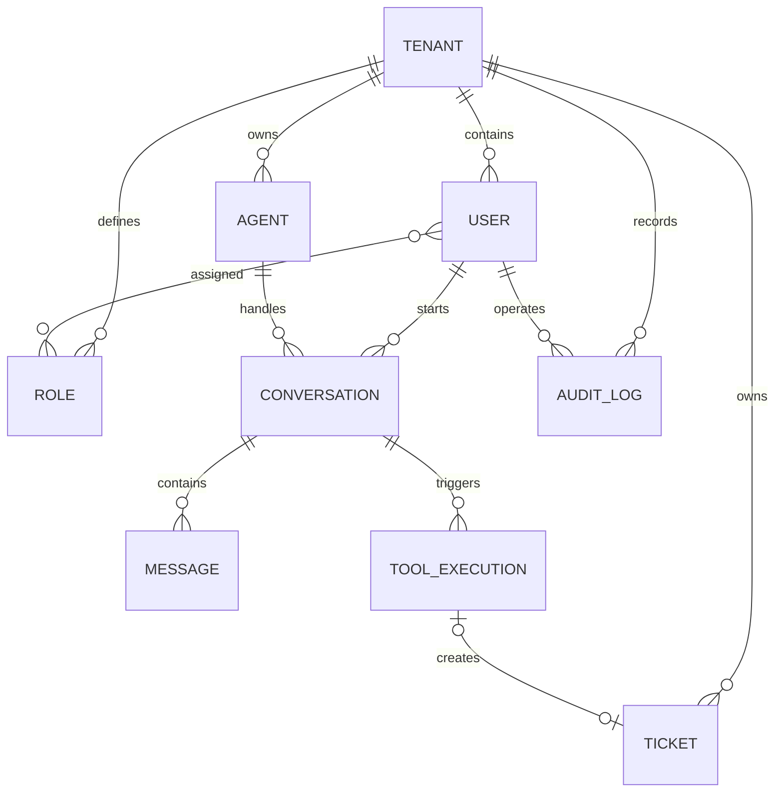

# NexusAgent 数据库设计

## 设计规范

- 数据库使用 MySQL 8
- 所有表名和字段名使用 snake_case
- 主键统一使用 BIGINT
- 业务数据必须包含 tenant_id
- 时间统一使用 UTC
- 业务表包含 created_at 和 updated_at
- 不在数据库中保存明文密码
- 审计日志只允许追加，不允许修改
- 状态字段使用可读字符串，不使用含义不明的数字

## 核心实体

### Tenant

企业租户，是所有业务数据的隔离边界。

### User

系统用户，属于一个租户。

### Role

租户内角色，一个用户可以拥有多个角色。

### Agent

Agent 定义，保存名称、系统提示词、模型配置和状态。

### Ticket

Agent 或用户创建的工单。

### Conversation

用户与某个 Agent 的一次会话。

### Message

会话中的用户消息、Agent 消息或者工具消息。

### ToolExecution

记录 Agent 每次工具调用的请求、结果、状态、耗时和错误。

### AuditLog

记录用户和 Agent 对业务数据执行的重要操作。

## 实体关系

## 计划中的数据表

1. tenants
2. users
3. roles
4. user_roles
5. agents
6. tickets
7. conversations
8. messages
9. tool_executions
10. audit_logs

## 全局字段规范

- 字符集：utf8mb4
- 主键类型：BIGINT，由应用程序生成
- 时间类型：DATETIME(3)，统一保存 UTC
- 金额禁止使用 FLOAT 或 DOUBLE
- 密码只保存哈希结果
- 业务数据原则上不物理删除，通过状态字段停用
- version 用于乐观锁，初始值为 0
- JSON 只用于结构不稳定的扩展数据
- API 密钥等机密信息禁止明文存入数据库

### tenants

租户表，是所有业务数据的隔离边界。

| 字段 | 类型 | 可空 | 说明 |
|---|---|---:|---|
| id | BIGINT | 否 | 应用生成的主键 |
| code | VARCHAR(64) | 否 | 租户唯一编码 |
| name | VARCHAR(128) | 否 | 租户名称 |
| status | VARCHAR(32) | 否 | ACTIVE、DISABLED |
| version | INT | 否 | 乐观锁版本号 |
| created_at | DATETIME(3) | 否 | 创建时间 |
| updated_at | DATETIME(3) | 否 | 更新时间 |

约束和索引：

- PRIMARY KEY：id
- UNIQUE：code
- INDEX：status

### users

租户内的系统用户。

| 字段 | 类型 | 可空 | 说明 |
|---|---|---:|---|
| id | BIGINT | 否 | 主键 |
| tenant_id | BIGINT | 否 | 所属租户 |
| username | VARCHAR(64) | 否 | 登录用户名 |
| email | VARCHAR(255) | 是 | 邮箱 |
| password_hash | VARCHAR(255) | 否 | 密码哈希 |
| display_name | VARCHAR(128) | 否 | 展示名称 |
| status | VARCHAR(32) | 否 | ACTIVE、LOCKED、DISABLED |
| last_login_at | DATETIME(3) | 是 |最后登录时间 |
| version | INT | 否 | 乐观锁版本号 |
| created_at | DATETIME(3) | 否 | 创建时间 |
| updated_at | DATETIME(3) | 否 | 更新时间 |

约束和索引：

- PRIMARY KEY：id
- UNIQUE：tenant_id + username
- UNIQUE：tenant_id + email
- INDEX：tenant_id + status
- FOREIGN KEY：tenant_id → tenants.id

### roles

租户内定义的角色。

| 字段 | 类型 | 可空 | 说明 |
|---|---|---:|---|
| id | BIGINT | 否 | 主键 |
| tenant_id | BIGINT | 否 | 所属租户 |
| code | VARCHAR(64) | 否 | ADMIN、MEMBER 等角色编码 |
| name | VARCHAR(128) | 否 | 角色名称 |
| description | VARCHAR(500) | 是 | 角色说明 |
| created_at | DATETIME(3) | 否 | 创建时间 |
| updated_at | DATETIME(3) | 否 | 更新时间 |

约束和索引：

- PRIMARY KEY：id
- UNIQUE：tenant_id + code
- FOREIGN KEY：tenant_id → tenants.id

### user_roles

用户与角色的多对多关系表。

| 字段 | 类型 | 可空 | 说明 |
|---|---|---:|---|
| tenant_id | BIGINT | 否 | 所属租户 |
| user_id | BIGINT | 否 | 用户ID |
| role_id | BIGINT | 否 | 角色ID |
| assigned_by | BIGINT | 是 | 分配角色的用户 |
| assigned_at | DATETIME(3) | 否 | 分配时间 |

约束和索引：

- PRIMARY KEY：tenant_id + user_id + role_id
- INDEX：tenant_id + role_id
- FOREIGN KEY：tenant_id → tenants.id
- FOREIGN KEY：user_id → users.id
- FOREIGN KEY：role_id → roles.id
- FOREIGN KEY：assigned_by → users.id

### agents

租户创建的 Agent 定义。模型密钥不能保存在该表中。

| 字段 | 类型 | 可空 | 说明 |
|---|---|---:|---|
| id | BIGINT | 否 | 主键 |
| tenant_id | BIGINT | 否 | 所属租户 |
| code | VARCHAR(64) | 否 | 租户内唯一编码 |
| name | VARCHAR(128) | 否 | Agent 名称 |
| description | VARCHAR(500) | 是 | Agent 描述 |
| system_prompt | LONGTEXT | 否 | 系统提示词 |
| model_provider | VARCHAR(64) | 否 | 模型提供方 |
| model_name | VARCHAR(128) | 否 | 模型名称 |
| model_config | JSON | 是 | 温度、最大Token等非机密配置 |
| status | VARCHAR(32) | 否 | DRAFT、ACTIVE、DISABLED |
| created_by_user_id | BIGINT | 否 | 创建者 |
| version | INT | 否 | 乐观锁版本 |
| created_at | DATETIME(3) | 否 | 创建时间 |
| updated_at | DATETIME(3) | 否 | 更新时间 |

约束和索引：

- PRIMARY KEY：id
- UNIQUE：tenant_id + code
- INDEX：tenant_id + status
- FOREIGN KEY：tenant_id → tenants.id
- FOREIGN KEY：created_by_user_id → users.id

### tickets

用户直接创建或 Agent 调用工具创建的工单。

| 字段 | 类型 | 可空 | 说明 |
|---|---|---:|---|
| id | BIGINT | 否 | 主键 |
| tenant_id | BIGINT | 否 | 所属租户 |
| ticket_no | VARCHAR(32) | 否 | 对外展示的工单编号 |
| title | VARCHAR(255) | 否 | 工单标题 |
| description | TEXT | 否 | 问题描述 |
| priority | VARCHAR(16) | 否 | LOW、MEDIUM、HIGH、URGENT |
| status | VARCHAR(32) | 否 | OPEN、IN_PROGRESS、RESOLVED、CLOSED |
| source | VARCHAR(32) | 否 | USER、AGENT、API |
| requester_user_id | BIGINT | 否 | 工单发起用户 |
| assignee_user_id | BIGINT | 是 | 当前处理人 |
| created_by_agent_id | BIGINT | 是 | 创建工单的 Agent |
| version | INT | 否 | 乐观锁版本 |
| created_at | DATETIME(3) | 否 | 创建时间 |
| updated_at | DATETIME(3) | 否 | 更新时间 |
| closed_at | DATETIME(3) | 是 | 关闭时间 |

约束和索引：

- PRIMARY KEY：id
- UNIQUE：tenant_id + ticket_no
- INDEX：tenant_id + status + created_at
- INDEX：tenant_id + requester_user_id
- INDEX：tenant_id + assignee_user_id + status
- FOREIGN KEY：tenant_id → tenants.id
- FOREIGN KEY：requester_user_id → users.id
- FOREIGN KEY：assignee_user_id → users.id
- FOREIGN KEY：created_by_agent_id → agents.id

### conversations

一个用户与一个 Agent 之间的一次会话。

| 字段 | 类型 | 可空 | 说明 |
|---|---|---:|---|
| id | BIGINT | 否 | 主键 |
| tenant_id | BIGINT | 否 | 所属租户 |
| user_id | BIGINT | 否 | 发起会话的用户 |
| agent_id | BIGINT | 否 | 对话使用的 Agent |
| title | VARCHAR(255) | 是 | 会话标题 |
| status | VARCHAR(32) | 否 | ACTIVE、COMPLETED、ARCHIVED |
| last_message_at | DATETIME(3) | 是 | 最后一条消息时间 |
| next_message_sequence | BIGINT | 否 | 下一条消息的会话内序号 |
| version | INT | 否 | 乐观锁版本 |
| created_at | DATETIME(3) | 否 | 创建时间 |
| updated_at | DATETIME(3) | 否 | 更新时间 |

约束和索引：

- PRIMARY KEY：id
- INDEX：tenant_id + user_id + updated_at
- INDEX：tenant_id + agent_id + status
- FOREIGN KEY：tenant_id → tenants.id
- FOREIGN KEY：user_id → users.id
- FOREIGN KEY：agent_id → agents.id

### messages

会话消息。消息创建完成后原则上不可修改。

| 字段 | 类型 | 可空 | 说明 |
|---|---|---:|---|
| id | BIGINT | 否 | 主键 |
| tenant_id | BIGINT | 否 | 所属租户 |
| conversation_id | BIGINT | 否 | 所属会话 |
| sequence_no | BIGINT | 否 | 会话内递增序号 |
| role | VARCHAR(32) | 否 | SYSTEM、USER、ASSISTANT、TOOL |
| content | LONGTEXT | 否 | 消息正文 |
| content_type | VARCHAR(32) | 否 | TEXT、MARKDOWN、JSON |
| status | VARCHAR(32) | 否 | CREATING、COMPLETED、FAILED |
| model_name | VARCHAR(128) | 是 | 生成消息的模型 |
| prompt_tokens | INT | 是 | 输入Token数量 |
| completion_tokens | INT | 是 | 输出Token数量 |
| metadata_json | JSON | 是 | 扩展元数据 |
| created_at | DATETIME(3) | 否 | 创建时间 |

约束和索引：

- PRIMARY KEY：id
- UNIQUE：conversation_id + sequence_no
- INDEX：tenant_id + conversation_id + created_at
- FOREIGN KEY：tenant_id → tenants.id
- FOREIGN KEY：conversation_id → conversations.id

### tool_executions

记录 Agent 工具调用的完整生命周期。

| 字段 | 类型 | 可空 | 说明 |
|---|---|---:|---|
| id | BIGINT | 否 | 主键 |
| tenant_id | BIGINT | 否 | 所属租户 |
| conversation_id | BIGINT | 否 | 所属会话 |
| agent_id | BIGINT | 否 | 发起调用的 Agent |
| request_message_id | BIGINT | 是 | 触发调用的消息 |
| result_message_id | BIGINT | 是 | 工具结果消息 |
| tool_call_id | VARCHAR(128) | 否 | 模型生成的调用编号 |
| tool_name | VARCHAR(128) | 否 | 工具名称 |
| idempotency_key | VARCHAR(128) | 否 | 幂等键 |
| input_json | JSON | 否 | 工具输入参数 |
| output_json | JSON | 是 | 工具输出结果 |
| status | VARCHAR(32) | 否 | PENDING、RUNNING、WAITING_APPROVAL、SUCCEEDED、FAILED、CANCELLED |
| approval_required | BOOLEAN | 否 | 是否需要人工审批 |
| result_entity_type | VARCHAR(64) | 是 | 结果业务实体类型 |
| result_entity_id | BIGINT | 是 | 结果业务实体ID |
| error_code | VARCHAR(64) | 是 | 错误编码 |
| error_message | VARCHAR(1000) | 是 | 脱敏后的错误信息 |
| trace_id | VARCHAR(64) | 是 | 链路追踪ID |
| started_at | DATETIME(3) | 是 | 开始执行时间 |
| completed_at | DATETIME(3) | 是 | 完成时间 |
| duration_ms | BIGINT | 是 | 执行耗时 |
| created_at | DATETIME(3) | 否 | 创建时间 |
| updated_at | DATETIME(3) | 否 | 更新时间 |

约束和索引：

- PRIMARY KEY：id
- UNIQUE：tenant_id + idempotency_key
- UNIQUE：tenant_id + conversation_id + tool_call_id
- INDEX：tenant_id + conversation_id + created_at
- INDEX：tenant_id + status + created_at
- INDEX：trace_id
- FOREIGN KEY：tenant_id → tenants.id
- FOREIGN KEY：conversation_id → conversations.id
- FOREIGN KEY：agent_id → agents.id
- FOREIGN KEY：request_message_id → messages.id
- FOREIGN KEY：result_message_id → messages.id

### audit_logs

不可修改的操作审计记录。

| 字段 | 类型 | 可空 | 说明 |
|---|---|---:|---|
| id | BIGINT | 否 | 主键 |
| tenant_id | BIGINT | 否 | 所属租户 |
| actor_type | VARCHAR(32) | 否 | USER、AGENT、SYSTEM |
| actor_id | BIGINT | 是 | 操作者ID |
| action | VARCHAR(128) | 否 | 操作名称 |
| resource_type | VARCHAR(64) | 否 | 被操作资源类型 |
| resource_id | BIGINT | 是 | 被操作资源ID |
| tool_execution_id | BIGINT | 是 | 关联工具执行 |
| result | VARCHAR(32) | 否 | SUCCESS、FAILURE、DENIED |
| request_id | VARCHAR(64) | 是 | HTTP请求ID |
| trace_id | VARCHAR(64) | 是 | 链路追踪ID |
| ip_address | VARCHAR(45) | 是 | IPv4或IPv6地址 |
| before_json | JSON | 是 | 操作前数据 |
| after_json | JSON | 是 | 操作后数据 |
| error_code | VARCHAR(64) | 是 | 错误编码 |
| error_message | VARCHAR(1000) | 是 | 脱敏后的错误信息 |
| created_at | DATETIME(3) | 否 | 创建时间 |

约束和索引：

- PRIMARY KEY：id
- INDEX：tenant_id + resource_type + resource_id
- INDEX：tenant_id + actor_type + actor_id + created_at
- INDEX：tenant_id + created_at
- INDEX：trace_id
- FOREIGN KEY：tenant_id → tenants.id
- FOREIGN KEY：tool_execution_id → tool_executions.id

## 核心业务规则

1. 所有关联实体必须属于同一个 tenant_id。
2. 所有业务查询必须显式携带 tenant_id。
3. ticket_no 是对外编号，不能使用数据库主键代替。
4. create_ticket 工具必须使用 idempotency_key 防止重复创建。
5. 工具执行前先创建 tool_executions 记录，完成后更新最终状态。
6. audit_logs 只允许 INSERT，不允许 UPDATE 或 DELETE。
7. 日志和错误信息必须过滤密码、Token及模型密钥。
8. Agent 代表用户创建工单时，同时记录 requester_user_id 和 created_by_agent_id。
9. tickets、agents、conversations 更新时必须校验 version。
10. messages 的 sequence_no 必须在同一会话内保持唯一且递增。
11. 消息写入方必须先锁定 conversations 行（SELECT ... FOR UPDATE），再从 next_message_sequence 分配 sequence_no，确保并发写入时序号连续且不重复。
12. 禁止在运行时使用 MAX(sequence_no) + 1 分配消息序号，必须使用 next_message_sequence 作为唯一分配源。

