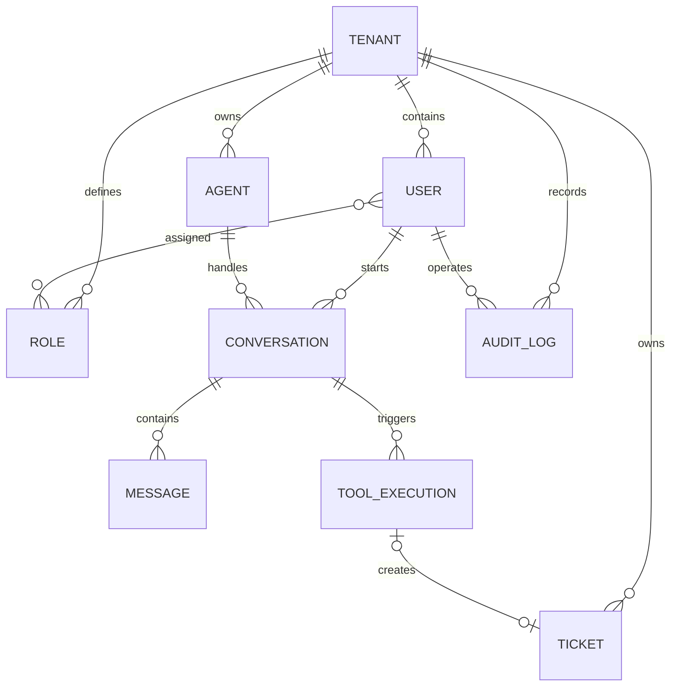

# NexusAgent 数据库设计

## 设计规范

- 数据库使用 MySQL 8
- 所有表名和字段名使用 snake_case
- 主键统一使用 BIGINT
- 业务数据必须包含 tenant_id
- 时间统一使用 UTC
- 业务表包含 created_at 和 updated_at
- 不在数据库中保存明文密码
- 审计日志只允许追加，不允许修改
- 状态字段使用可读字符串，不使用含义不明的数字

## 核心实体

### Tenant

企业租户，是所有业务数据的隔离边界。

### User

系统用户，属于一个租户。

### Role

租户内角色，一个用户可以拥有多个角色。

### Agent

Agent 定义，保存名称、系统提示词、模型配置和状态。

### Ticket

Agent 或用户创建的工单。

### Conversation

用户与某个 Agent 的一次会话。

### Message

会话中的用户消息、Agent 消息或者工具消息。

### ToolExecution

记录 Agent 每次工具调用的请求、结果、状态、耗时和错误。

### AuditLog

记录用户和 Agent 对业务数据执行的重要操作。

## 实体关系

## 计划中的数据表

1. tenants
2. users
3. roles
4. user_roles
5. agents
6. tickets
7. conversations
8. messages
9. tool_executions
10. audit_logs

## 全局字段规范

- 字符集：utf8mb4
- 主键类型：BIGINT，由应用程序生成
- 时间类型：DATETIME(3)，统一保存 UTC
- 金额禁止使用 FLOAT 或 DOUBLE
- 密码只保存哈希结果
- 业务数据原则上不物理删除，通过状态字段停用
- version 用于乐观锁，初始值为 0
- JSON 只用于结构不稳定的扩展数据
- API 密钥等机密信息禁止明文存入数据库

### tenants

租户表，是所有业务数据的隔离边界。

| 字段 | 类型 | 可空 | 说明 |
|---|---|---:|---|
| id | BIGINT | 否 | 应用生成的主键 |
| code | VARCHAR(64) | 否 | 租户唯一编码 |
| name | VARCHAR(128) | 否 | 租户名称 |
| status | VARCHAR(32) | 否 | ACTIVE、DISABLED |
| version | INT | 否 | 乐观锁版本号 |
| created_at | DATETIME(3) | 否 | 创建时间 |
| updated_at | DATETIME(3) | 否 | 更新时间 |

约束和索引：

- PRIMARY KEY：id
- UNIQUE：code
- INDEX：status

### users

租户内的系统用户。

| 字段 | 类型 | 可空 | 说明 |
|---|---|---:|---|
| id | BIGINT | 否 | 主键 |
| tenant_id | BIGINT | 否 | 所属租户 |
| username | VARCHAR(64) | 否 | 登录用户名 |
| email | VARCHAR(255) | 是 | 邮箱 |
| password_hash | VARCHAR(255) | 否 | 密码哈希 |
| display_name | VARCHAR(128) | 否 | 展示名称 |
| status | VARCHAR(32) | 否 | ACTIVE、LOCKED、DISABLED |
| last_login_at | DATETIME(3) | 是 |最后登录时间 |
| version | INT | 否 | 乐观锁版本号 |
| created_at | DATETIME(3) | 否 | 创建时间 |
| updated_at | DATETIME(3) | 否 | 更新时间 |

约束和索引：

- PRIMARY KEY：id
- UNIQUE：tenant_id + username
- UNIQUE：tenant_id + email
- INDEX：tenant_id + status
- FOREIGN KEY：tenant_id → tenants.id

### roles

租户内定义的角色。

| 字段 | 类型 | 可空 | 说明 |
|---|---|---:|---|
| id | BIGINT | 否 | 主键 |
| tenant_id | BIGINT | 否 | 所属租户 |
| code | VARCHAR(64) | 否 | ADMIN、MEMBER 等角色编码 |
| name | VARCHAR(128) | 否 | 角色名称 |
| description | VARCHAR(500) | 是 | 角色说明 |
| created_at | DATETIME(3) | 否 | 创建时间 |
| updated_at | DATETIME(3) | 否 | 更新时间 |

约束和索引：

- PRIMARY KEY：id
- UNIQUE：tenant_id + code
- FOREIGN KEY：tenant_id → tenants.id

### user_roles

用户与角色的多对多关系表。

| 字段 | 类型 | 可空 | 说明 |
|---|---|---:|---|
| tenant_id | BIGINT | 否 | 所属租户 |
| user_id | BIGINT | 否 | 用户ID |
| role_id | BIGINT | 否 | 角色ID |
| assigned_by | BIGINT | 是 | 分配角色的用户 |
| assigned_at | DATETIME(3) | 否 | 分配时间 |

约束和索引：

- PRIMARY KEY：tenant_id + user_id + role_id
- INDEX：tenant_id + role_id
- FOREIGN KEY：tenant_id → tenants.id
- FOREIGN KEY：user_id → users.id
- FOREIGN KEY：role_id → roles.id
- FOREIGN KEY：assigned_by → users.id

